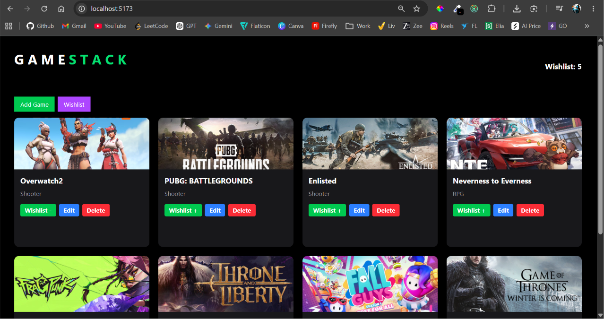
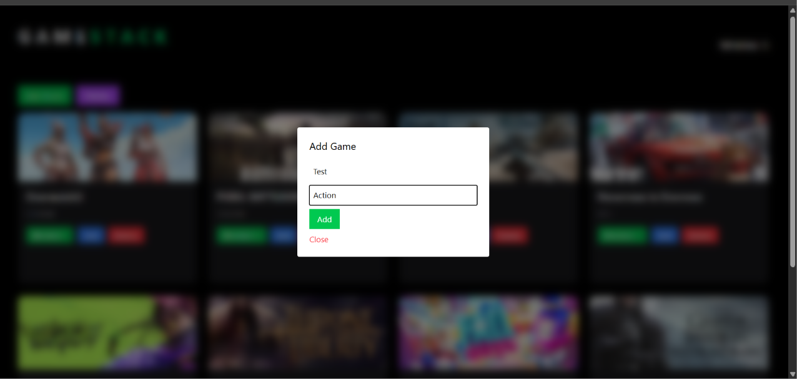
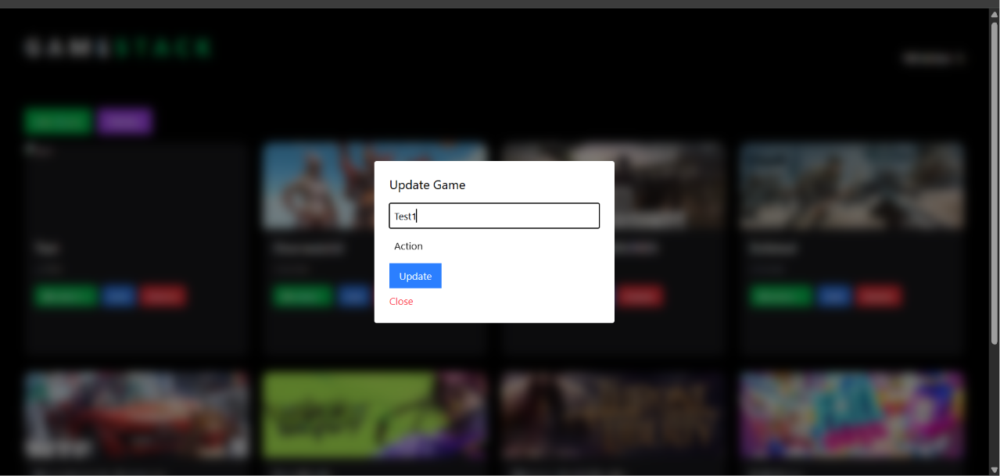
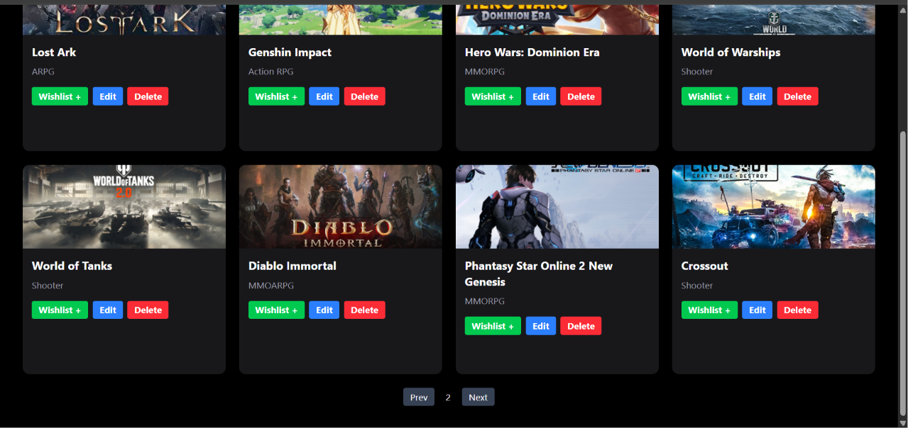
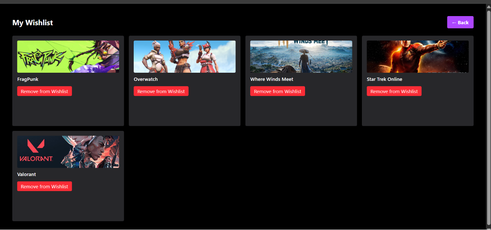
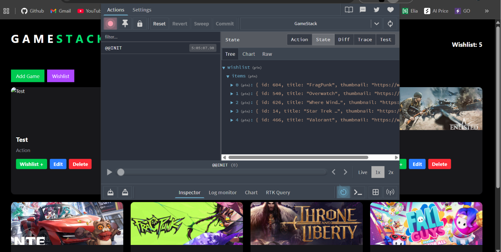

# 🎮 GameStack – Full Stack Project Overview

GameStack is a full-stack web application built using **Go (Golang) for backend** and **React + Redux for frontend**. It allows users to browse games, manage a wishlist, and perform full CRUD operations.

---

## 🚀 Core Features

### 🎯 Backend (Go)
- REST API using `net/http`
- In-memory game storage (slice-based)
- CRUD operations:
  - Create Game
  - Read Games (limited to 100)
  - Update Game
  - Delete Game
- Query parameter handling (`id`)
- CORS enabled for frontend communication

---

### 💻 Frontend (React)
- Component-based architecture
- Game listing in grid format
- Modal-based Add & Update forms
- React Router navigation
- Axios for API calls
- Pagination (frontend slicing)
- External game link redirection on click

---

### 🧠 State Management (Redux Toolkit)
- Wishlist feature using global state
- Add / Remove wishlist games
- Wishlist counter in Navbar
- Wishlist page for saved games

---

# 🖼️ UI Screenshots

Below are the key screens of the GameStack application:

---

## 🏠 Home Page

---

## ➕ Add Game Modal

---

## ✏️ Update Game Modal

---

## 📄 Pagination

---

## ❤️ Wishlist Page

---

## 🧠 Redux State Management

---

## 🔄 Key Workflows

### CRUD Flow
1. User performs action (Add / Edit / Delete)
2. API call sent to Go backend
3. Backend updates in-memory array
4. Frontend refreshes data via `fetchGames()`

---

### Wishlist Flow
1. User clicks Wishlist button
2. Redux updates global state
3. Navbar and Wishlist page reflect changes instantly

---

## 📌 Important Notes
- No database used (data resets on server restart)
- Backend acts as a lightweight API server
- Frontend handles pagination and UI state
- Designed for learning full-stack architecture

---

## 🧱 Tech Stack

**Frontend:** React, Redux Toolkit, React Router, Tailwind CSS, Axios  
**Backend:** Go (net/http), JSON encoding/decoding  

